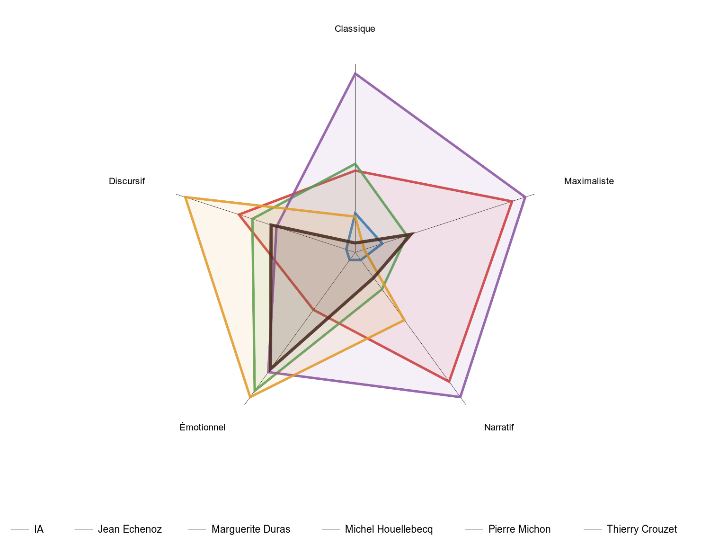
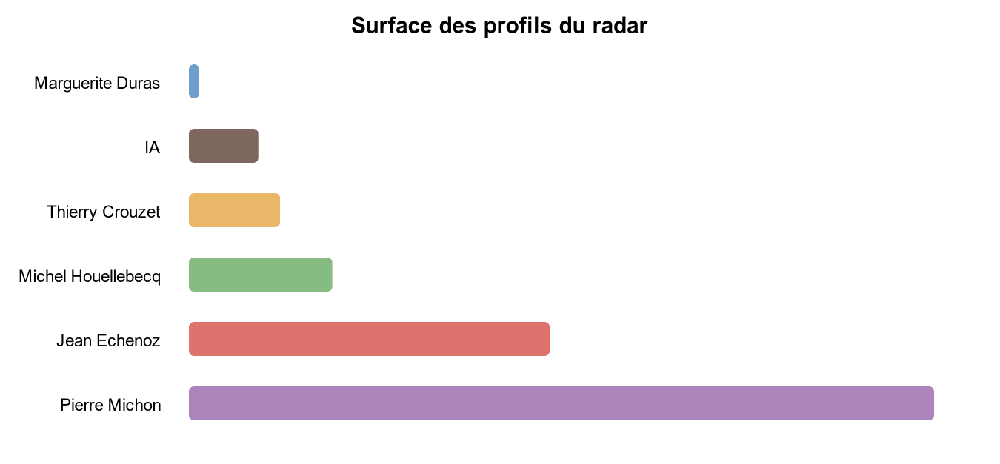
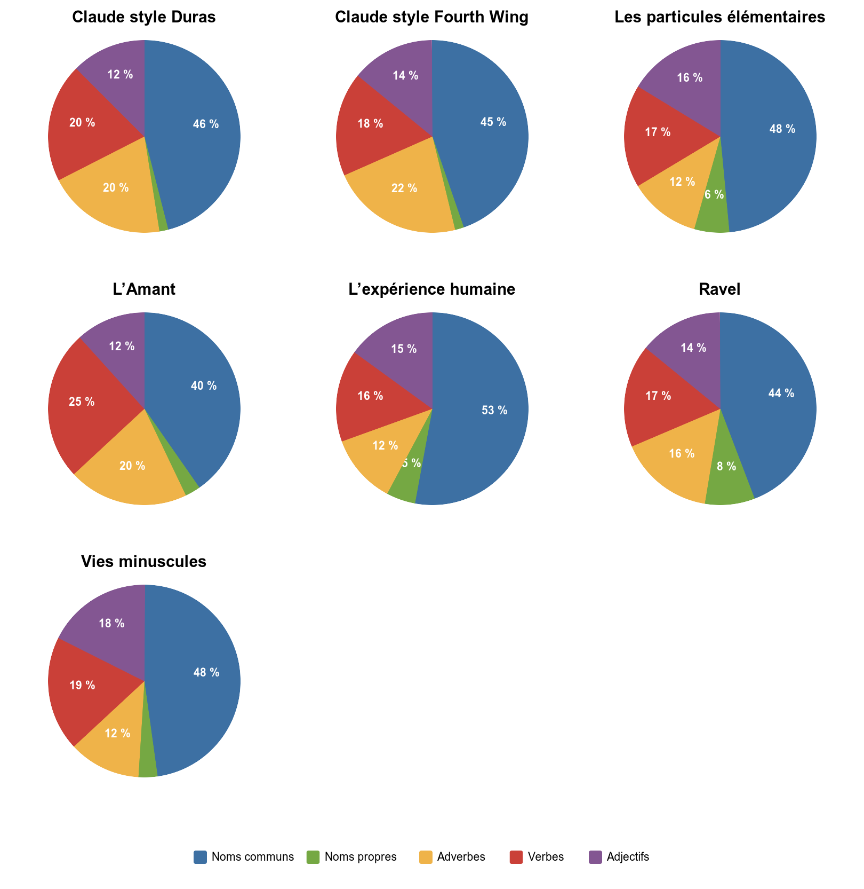

# Unshiter — analyse statistique de textes

Unshiter compare des textes français sans demander à un modèle génératif de les juger. Il mesure leur ponctuation, leur rythme, leurs répétitions, leurs structures syntaxiques et leur répartition grammaticale. Les résultats décrivent les textes du corpus ; ils ne constituent pas une preuve d’origine humaine ou artificielle.

## Installation

```bash
python3 -m venv venv
venv/bin/python -m pip install -r requirements.txt
```

Le projet utilise spaCy 3.8.13 avec le modèle français `fr_core_news_lg` 3.8.0. Le modèle est installé par `requirements.txt`.

## Lancer une comparaison

Placez les fichiers Markdown dans `sources/`, puis lancez :

```bash
./stats.sh
```

Les fichiers sont classés ainsi :

- un fichier sans `_` initial est considéré comme un texte IA ;
- tous les fichiers IA sont fusionnés dans une seule colonne `IA` ;
- un fichier commençant par `_` est considéré comme humain ;
- les textes humains sont affichés après `IA`, par ordre alphabétique ;
- le `_` initial et l’extension `.md` ne sont pas affichés dans les titres.

Pour analyser un seul fichier et produire ses rapports Markdown et JSON :

```bash
./stats.sh sources/IA.md
```

## Fichiers produits

Les sorties sont écrites dans `_output/` :

- `stats_comparison.md` : tableaux comparatifs et graphiques intégrés ;
- `kiviat.svg` : radar des mesures du tableau principal ;
- `kiviat_areas.svg` : surface des profils du radar, classée par ordre croissant ;
- `grammatical_distribution.svg` : camemberts grammaticaux, trois par ligne ;
- `*_structure.md` : phrases et structures reconnues ;
- `*_lemmes.md` : textes lemmatisés avec répétitions signalées.

<!-- STATS:START -->
## Dernier résultat

Ces tableaux et leurs notes sont actualisés automatiquement par `./stats.sh`.

### Synthèse

| Mesure | IA | Crouzet | Duras | Echenoz | Houellebecq | Michon | σ[^1] |
|---|---:|---:|---:|---:|---:|---:|---:|
| Ponctuation (signes/300 mots)[^2] | 36.1 | 57.9 | 50.2 | 43.4 | 52.7 | 50.6 | 14.4 % |
| Diversité de ponctuation[^3] | 40 % | 61 % | 40 % | 45 % | 64 % | 58 % | 19.5 % |
| Diversité des structures[^4] | 42 % | 48 % | 53 % | 61 % | 53 % | 65 % | 14.3 % |
| Rythme des structures[^5] | 41 % | 49 % | 51 % | 53 % | 47 % | 59 % | 11.0 % |
| Profondeur syntaxique[^6] | 3.7 | 3.2 | 3.5 | 5.1 | 3.7 | 4.5 | 16.1 % |
| Diversité des débuts de phrase[^7] | 52 % | 72 % | 59 % | 78 % | 76 % | 76 % | 14.1 % |
| Burstiness[^8] | 0.69 | 0.67 | 0.79 | 0.60 | 0.58 | 0.87 | 14.6 % |
| Ratio noms/verbes[^9] | 1.56 | 2.09 | 1.88 | 2.17 | 2.06 | 2.20 | 5.4 % |
| Répétitions lexicales[^10] | 9 % | 10 % | 16 % | 12 % | 12 % | 9 % | 11.5 % |

### Détails

| Mesure | IA | Crouzet | Duras | Echenoz | Houellebecq | Michon | σ[^1] |
|---|---:|---:|---:|---:|---:|---:|---:|
| Diversité stylistique[^11] | 90.4 % | 86.5 % | 72.1 % | 86.2 % | 86.0 % | 89.8 % | 2.2 % |
| Répétitions familiales[^12] | 12 % | 12 % | 18 % | 14 % | 14 % | 12 % | 9.6 % |
| Répétitions sonores[^13] | 20 % | 19 % | 20 % | 20 % | 22 % | 19 % | 2.4 % |
| Répétitions non filtrées[^14] | 55 % | 53 % | 64 % | 53 % | 53 % | 51 % | 2.4 % |
| Répétition globale des trigrammes[^15] | 1.0 % | 1.1 % | 2.8 % | 0.9 % | 1.4 % | 0.5 % | 31.4 % |
| Répétition locale des trigrammes[^16] | 0.3 % | 0.5 % | 1.6 % | 0.3 % | 0.7 % | 0.1 % | 51.6 % |
| Mots-outils[^17] | 43 % | 39 % | 40 % | 37 % | 35 % | 36 % | 6.8 % |
| Noms[^18] | 29 % | 35 % | 32 % | 35 % | 35 % | 35 % | 3.1 % |
| Verbes[^19] | 19 % | 17 % | 17 % | 17 % | 17 % | 16 % | 3.3 % |
| Adjectifs[^20] | 4 % | 5 % | 3 % | 4 % | 5 % | 6 % | 20.4 % |
| Adverbes[^21] | 6 % | 5 % | 6 % | 6 % | 6 % | 5 % | 11.6 % |
| Diversité de longueurs de phrase (mots)[^22] | 7.8 | 8.7 | 13.7 | 15.4 | 12.0 | 37.4 | 25.1 % |
| Compression gzip[^23] | 42 % | 46 % | 41 % | 45 % | 45 % | 46 % | 4.2 % |
| Relatives et subordonnées[^24] | 131 % | 104 % | 135 % | 279 % | 118 % | 207 % | 37.7 % |
| Phrases nominales[^25] | 7 % | 21 % | 10 % | 10 % | 10 % | 10 % | 3.6 % |
| Voix active[^26] | 81 % | 66 % | 70 % | 77 % | 73 % | 77 % | 6.9 % |
| Comparaisons métaphoriques[^27] | 2.1 % | 3.4 % | 6.3 % | 9.9 % | 3.2 % | 12.8 % | 61.8 % |
| Formes par lemme[^28] | 0.83 | 0.85 | 0.91 | 0.87 | 0.88 | 0.86 | 1.9 % |
| Mots employés une seule fois[^29] | 72 % | 76 % | 66 % | 75 % | 74 % | 77 % | 2.3 % |
| Mots | 1743 | 49880 | 29454 | 22614 | 91510 | 58784 | — |
| Phrases | 134 | 4088 | 1972 | 877 | 4811 | 1336 | — |
| Paragraphes | 33 | 834 | 248 | 153 | 889 | 282 | — |
| Longueur moyenne des mots (caractères) | 5.0 | 4.8 | 4.4 | 4.7 | 5.0 | 4.8 | — |
| Longueur moyenne des phrases (caractères) | 78.6 | 73.3 | 83.9 | 154.7 | 123.0 | 276.7 | — |
| Longueur moyenne des phrases (mots) | 13.0 | 12.4 | 15.3 | 26.7 | 19.8 | 46.1 | — |
| Longueur médiane des phrases (caractères) | 67.5 | 59.8 | 62.6 | 144.4 | 106.5 | 222.5 | — |
| Longueur P10 des phrases (caractères) | 29.3 | 23.0 | 23.4 | 49.9 | 45.2 | 51.4 | — |
| Longueur P90 des phrases (caractères) | 145.6 | 139.9 | 164.2 | 264.3 | 218.9 | 567.8 | — |
| Écart-type des paragraphes (mots) | 34.4 | 40.2 | 105.8 | 62.0 | 107.7 | 129.5 | — |
| Fenêtres analysées | 1 | 28 | 16 | 12 | 49 | 31 | — |
| Longueur moyenne des paragraphes (mots) | 52.8 | 66.5 | 127.0 | 150.8 | 126.5 | 234.9 | — |

### Profil comparatif



Le diagramme reprend exactement les mesures du tableau principal. L’anneau médian représente la moyenne du corpus avec le même gris que les autres lignes de lecture. Les écarts relatifs à cette moyenne sont amplifiés pour rendre les profils lisibles ; les répétitions lexicales sont inversées afin que l’extérieur indique toujours davantage de diversité ou de complexité.


### Surface des profils



Les surfaces sont calculées directement sur les polygones du radar et classées de la plus petite à la plus grande. Leur unité est arbitraire.


### Répartition grammaticale par document




[^1]: Indique à quel point les valeurs diffèrent dans le corpus. Le calcul commence par écarter les valeurs aberrantes selon la règle de Tukey : toute valeur située à plus de 1,5 fois l’intervalle interquartile sous le premier quartile ou au-dessus du troisième quartile est ignorée. Elle reste affichée dans le tableau, mais ne gonfle pas σ. L’écart-type des valeurs restantes est ensuite divisé par leur moyenne et affiché en pourcentage. Un σ faible signale une mesure non significative.

[^2]: Pourcentage de signes de ponctuation relevés pour 300 mots. Les signes comptés sont le point, la virgule, le point-virgule, les deux-points, les points d’interrogation et d’exclamation, les points de suspension, les tirets, les parenthèses et les guillemets.

[^3]: Répartition des signes de ponctuation en dix familles : point, virgule, point-virgule, deux-points, interrogation, exclamation, tiret, parenthèses, guillemets et points de suspension. Le calcul utilise l’entropie de cette répartition, ramenée entre 0 et 100 %.

[^4]: Chaque phrase est d’abord transformée en propositions simplifiées, par exemple `SUJET VERBE COMPLÉMENT` ou `PROPOSITION_SUBORDONNÉE`. Les déterminants et prépositions n'ont pas des rôles. Les virgules et les points sont conservés dans les propositions ordinaires. Les répétitions internes sont comptées : une phrase peut ainsi devenir `SUJET VERBE COMPLÉMENT + 5 PROPOSITIONS_SUBORDONNÉES`.

Deux phrases sont comparées en combinant deux distances : 75 % pour la différence entre les proportions de leurs constructions et 25 % pour la différence entre leurs nombres d’occurrences. Cette distance est ensuite pondérée par la quantité d’information disponible : le poids augmente avec le nombre cumulé de propositions et atteint son maximum à douze. Deux phrases très courtes ne peuvent donc pas créer seules une opposition maximale. À l’inverse, cinq subordonnées identiques apportent moins de diversité que cinq constructions différentes. La valeur finale est la moyenne des distances entre toutes les paires de phrases, de 0 à 100 %.

<!-- Proposition de Codex :
La diversité des longueurs entre directement dans le calcul : les phrases comportant davantage de propositions reçoivent progressivement plus de poids, jusqu’à douze propositions cumulées. Cet avantage reste modéré par la variété réelle des constructions : répéter cinq subordonnées identiques apporte moins de diversité que cinq constructions différentes.
-->

[^5]: Compare chaque structure de phrase à la suivante dans l’ordre du texte. La distance d’édition compte les rôles qu’il faudrait ajouter, supprimer ou remplacer pour passer d’un patron à l’autre, puis divise ce nombre par la longueur du patron le plus long. Le résultat final est la moyenne de ces distances. 0 % signifie que les mêmes patrons se succèdent ; une valeur élevée indique des changements structurels fréquents.

[^6]: Mesure la complexité hiérarchique des phrases reconnue par spaCy. Plus des groupes et propositions sont emboîtés les uns dans les autres, plus les mots les plus éloignés nécessitent de relations pour rejoindre le verbe principal, et plus la profondeur augmente.

[^7]: Pour chaque phrase, le premier mot est relevé après tokenisation. Le calcul examine des fenêtres glissantes de vingt phrases et mesure, dans chacune, le nombre de premiers mots différents divisé par vingt. Le rapport affiche la moyenne de ces fenêtres. Si le texte compte moins de vingt phrases, le calcul porte sur toutes ses phrases. 100 % signifie qu’aucun début ne se répète dans la fenêtre considérée.

[^8]: Pour chaque paire de phrases consécutives, le calcul prend la différence absolue de longueur en caractères. La moyenne de ces différences est divisée par la longueur moyenne des phrases : `moyenne(|longueur suivante − longueur précédente|) / longueur moyenne`. Une valeur de 0 indique des phrases successives de même longueur. La division par la moyenne permet de comparer des textes composés de phrases globalement courtes ou longues.

[^9]: Nombre de noms reconnu par Morphalou divisé par le nombre de verbes reconnu par Morphalou. Une valeur de 2 signifie que le texte contient deux noms pour un verbe. Si aucun verbe n’est reconnu, la valeur est fixée à 0 pour éviter une division impossible.

[^10]: Pour chaque mot, le programme cherche le même lemme parmi les 300 mots précédents. Les flexions sont donc regroupées : `marche`, `marches` et `marchaient` peuvent renvoyer au même lemme. Le pourcentage est le nombre de mots ayant un antécédent divisé par le nombre total de mots analysés. Les mots-outils et les graphies de moins de deux caractères ne peuvent pas être signalés, mais le dénominateur reste l’ensemble des mots retenus. La lemmatisation contextuelle vient de spaCy, avec Morphalou comme repli.

[^11]: Examine les 300 mots précédents et additionne une pression de 1 pour une graphie identique, 0,25 pour le même lemme et 0,25 pour la même famille morphologique. Les mots-outils et noms propres sont écartés. La pression totale est divisée par le nombre de mots puis plafonnée à 100 %. Une diversité stylistique élevée signifie donc une faible pression de ces répétitions locales.

[^12]: Même calcul local que les répétitions lexicales, mais deux mots sont aussi rapprochés lorsqu’ils appartiennent à une même famille morphologique dans Démonette, par exemple `écrire`, `écrivain` et `écriture`. Pour chaque mot, une ou plusieurs correspondances dans les 300 mots précédents comptent comme une seule répétition.

[^13]: Pour chaque mot, le programme cherche dans les 300 mots précédents une prononciation partageant une suite continue d’au moins trois phonèmes. Cette suite doit couvrir au moins 60 % de la prononciation la plus courte. Le pourcentage indique la part des mots pour lesquels un tel écho a été trouvé. Cette approximation phonétique ne remplace pas une lecture à voix haute.

[^14]: Même calcul que les répétitions lexicales, mais en conservant les mots-outils. La mesure inclut donc les répétitions grammaticales ordinaires du français et sera naturellement beaucoup plus élevée que la version filtrée.

[^15]: Un trigramme est une suite de trois mots consécutifs. Le programme compte les trigrammes distincts présents plus d’une fois, puis divise ce nombre par le nombre total de trigrammes distincts. Il s’agit donc d’une proportion de types répétés, et non de toutes les occurrences répétées.

[^16]: Même proportion de trigrammes distincts répétés, calculée dans des fenêtres glissantes de 200 mots espacées de 50 mots, puis moyennée. Cette version privilégie les formulations qui reviennent à proximité. Pour un texte de 200 mots ou moins, elle est identique à la répétition globale.

[^17]: Part des mots classés comme déterminants, pronoms, prépositions, conjonctions ou interjections. Les adverbes ne sont pas inclus. La liste éditable se trouve dans `assets/function-words.txt` et complète les catégories de Morphalou. Cette mesure décrit la place du matériel grammatical dans le texte ; elle ne constitue pas à elle seule un jugement de qualité.

[^18]: Nombre de mots classés comme noms par Morphalou, divisé par le nombre total de mots auxquels Morphalou attribue une catégorie grammaticale. Les quatre lignes noms, verbes, adjectifs et adverbes ne totalisent pas nécessairement 100 %, car le dénominateur comprend aussi d’autres catégories.

[^19]: Nombre de mots classés comme verbes par Morphalou, divisé par le nombre total de mots auxquels Morphalou attribue une catégorie grammaticale.

[^20]: Nombre de mots classés comme adjectifs par Morphalou, divisé par le nombre total de mots auxquels Morphalou attribue une catégorie grammaticale.

[^21]: Nombre de mots classés comme adverbes par Morphalou, divisé par le nombre total de mots auxquels Morphalou attribue une catégorie grammaticale.

[^22]: Écart-type du nombre de mots par phrase. Une valeur élevée indique une alternance plus forte entre phrases courtes et longues. Cette ligne reste dans le tableau détaillé, car la diversité des structures intègre déjà une partie de cette information en accordant progressivement davantage de poids aux phrases contenant plusieurs propositions.

[^23]: Le texte UTF-8 est compressé avec gzip. La taille compressée est divisée par la taille originale et affichée en pourcentage. Une valeur basse signifie que les octets du texte sont plus prévisibles et se compressent mieux. Pour comparer les documents, le programme utilise des blocs non chevauchants ayant exactement la taille en octets du texte le plus court, puis moyenne leurs rapports.

[^24]: spaCy compte les dépendances de relative (`acl:relcl`) et les autres dépendances subordonnées configurées (`acl`, `advcl`, `ccomp`, `csubj`, `xcomp`). Leur somme est divisée par le nombre de phrases. La valeur peut dépasser 100 % : une phrase peut contenir plusieurs subordonnées. Ce résultat dépend de l’analyse du modèle spaCy.

[^25]: Part des phrases dans lesquelles spaCy ne trouve aucun verbe conjugué. Les infinitifs et participes isolés ne suffisent pas à rendre la phrase verbale. La mesure repère notamment des ruptures comme « Un cauchemar. Encore un. », mais dépend de la qualité de l’analyse syntaxique.

[^26]: Pourcentage des phrases du document contenant une construction verbale active et aucune construction passive. Le passif est reconnu par une dépendance `aux:pass`, un sujet `nsubj:pass` ou la marque morphologique `Voice=Pass`. La présence de l’auxiliaire « être » ne suffit pas : dans « il était allé », « était » construit un temps composé actif. 100 % signifie que toutes les phrases sont verbales et actives. Cette mesure est calculée sur le document entier, sans fenêtre.

[^27]: Pourcentage des phrases du document contenant au moins une comparaison détectée. Le programme reconnaît les « comme » comparatifs ainsi que les locutions inscrites dans `assets/comparison-markers.txt`. « Il courait comme un chien enragé » et « Il courait comme Charlot courait » sont comptés ; « Comme il pleuvait, il restait chez lui » ne l’est pas. 100 % signifie que chaque phrase contient au moins une comparaison. Cette mesure est calculée sur le document entier, sans fenêtre. Elle repère une forme comparative, sans pouvoir garantir que l’image soit sémantiquement une métaphore.

[^28]: Dans chaque fenêtre mobiles de 300 mots, la diversité des formes graphiques est divisée par la diversité des lemmes.

[^29]: Nombre de lemmes lexicaux Morphalou apparaissant exactement une fois, divisé par le nombre de lemmes lexicaux distincts.
<!-- STATS:END -->

Une empreinte SHA-256 des sources, du code de calcul et des configurations qui influencent les mesures est enregistrée dans `_temp/stats-cache.json`. Les statistiques calculées sont conservées avec cette empreinte. Modifier `assets/stats-notes.md` ne l’invalide pas : `./stats.sh` régénère alors le rapport et le README depuis les valeurs en cache, sans recommencer l’analyse spaCy.

## Fenêtres de comparaison

Les textes n’ont pas tous la même taille. Pour éviter qu’un roman bénéficie simplement d’un plus grand échantillon, les mesures dérivées sont calculées sur des fenêtres non chevauchantes ayant pour cible le nombre de mots du texte le plus court.

Une fenêtre se termine toujours à la fin d’un paragraphe. Elle peut donc dépasser légèrement la cible. Si la dernière fenêtre contient moins de 70 % de la cible, elle n’est pas prise en compte. Lorsqu’un texte entier est plus court que ce seuil et ne fournit aucune autre fenêtre, il reste analysé comme un seul bloc. Les mesures des fenêtres retenues sont ensuite moyennées pour chaque document.

Gzip suit une règle différente : ses blocs sont découpés en octets UTF-8 et ont exactement la taille du texte le plus court en octets. Les comptages techniques — mots, phrases et paragraphes — décrivent toujours le document complet.


## Graphiques

Le radar reprend exactement les mesures du tableau principal. Pour chaque axe, le rayon médian correspond à la moyenne du corpus. La position vaut `0,5 + 1,25 × (valeur − moyenne) / moyenne`, limitée entre 0,05 et 1. Les répétitions lexicales sont inversées afin que l’extérieur corresponde à moins de répétitions. Toutes les lignes de lecture utilisent le même gris.

L’histogramme des surfaces applique la formule géométrique de l’aire à chaque polygone du radar, puis classe les auteurs de la plus petite à la plus grande surface. Son unité est arbitraire et dépend des axes retenus, de leur ordre et de l’amplification du radar.

## Limites

- Les résultats dépendent du découpage en phrases, des dictionnaires et du modèle spaCy.
- Morphalou analyse les formes hors contexte et peut conserver des ambiguïtés.
- Les ellipses, incises, phrases nominales et constructions littéraires peuvent dégrader l’analyse spaCy.
- Une mesure très dispersée dans le corpus actuel ne le sera pas nécessairement dans un autre corpus.
- Les graphiques résument les mesures choisies ; ils ne calculent pas une probabilité d’origine IA.

## Organisation du projet

- `script/detector/` : calculs, interface et tests ;
- `assets/` : Morphalou, Démonette, mots-outils et notes du rapport ;
- `sources/` : corpus Markdown ;
- `_output/` : rapports générés ;
- `_temp/` : cache et fichiers temporaires.

Tous les chemins sont définis dans `script/detector/config.py`.

`assets/stats-notes.md` est le texte éditorial des notes affichées dans le rapport. Après la présente réécriture, il ne doit plus être modifié automatiquement : toute proposition ultérieure doit être formulée en commentaire afin de laisser le dernier mot à son auteur.

## Tests

```bash
PYTHONPATH=script python3 -m unittest discover -s script/detector/tests -v
```
