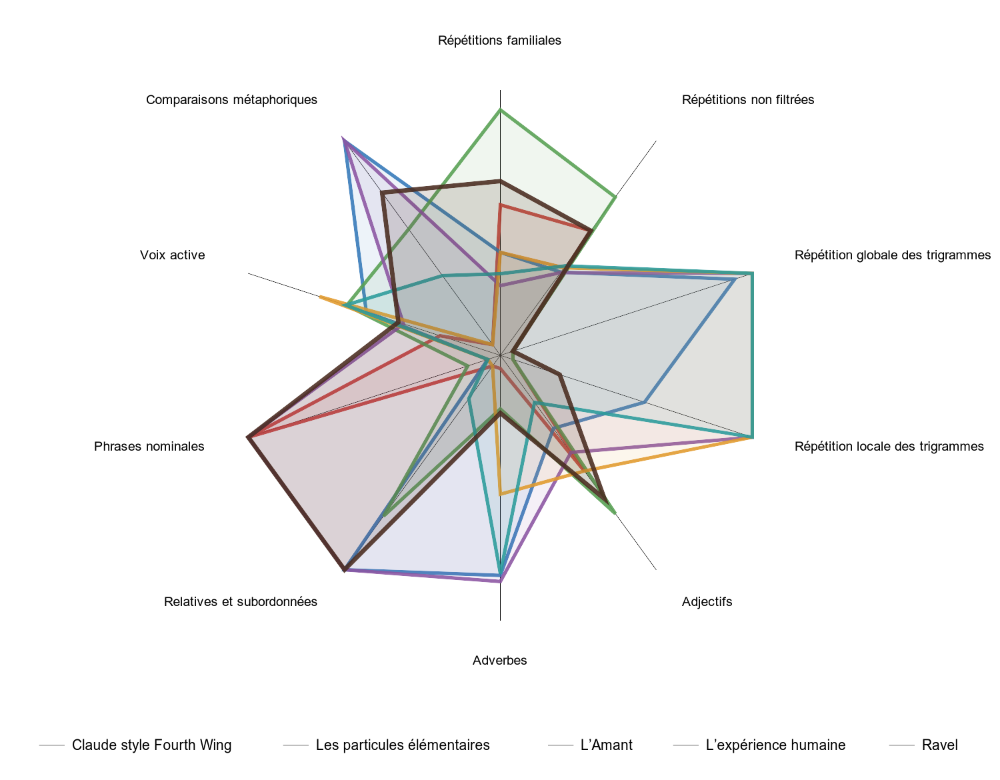

# Unshiter — analyse statistique de textes

Unshiter compare des textes français à partir de mesures reproductibles : ponctuation, rythme, répétitions lexicales et sonores, structures syntaxiques, catégories grammaticales et statistiques de longueur. Les résultats décrivent un corpus ; ils ne constituent ni une preuve d’origine humaine ou artificielle, ni un jugement littéraire.

## Installation

```bash
python3 -m venv venv
venv/bin/python -m pip install -r requirements.txt
```

Le calcul syntaxique utilise spaCy et le modèle français `fr_core_news_lg`. Morphalou et Démonette sont indexés dans `assets/`. Tous les chemins utilisés par les modules sont centralisés dans `script/detector/config.py`.

## Flux de travail

La base SQLite `assets/unshiter.sqlite3` est la source de vérité. Les scripts ne recalculent une œuvre que si son Markdown, la version d’analyse ou les données nécessaires ont changé.

### Ajouter ou actualiser des EPUB

Les EPUB sont déposés dans `_epub/`. L’extraction produit un Markdown normalisé dans le même dossier ; les préliminaires, titres, citations et paragraphes sont convertis selon le balisage de l’EPUB. La première fenêtre d’analyse est limitée à la taille configurée dans `config.py`.

```bash
./epubs.sh
```

La commande met à jour la base, supprime les livres disparus et signale les publications sans date. Les corrections éditoriales (titre ou année) se font dans `assets/publication.yml` ; les entrées sont conservées lors des actualisations.

Les Markdown placés dans `sources/` sont également indexés. C’est le champ `author` de leur en-tête YAML qui détermine le classement : `author: "IA"` les place dans le groupe IA, quel que soit le nom du fichier ; toute autre valeur les classe parmi les textes humains. Chaque fichier IA reste une œuvre distincte dans la base et dans le rapport.

### Générer le rapport README

```bash
./readme.sh
```

`readme.sh` ne fait que produire le rapport comparatif à partir de la base SQLite et actualiser le bloc statistique de ce README. Il génère :

Les œuvres dont l’en-tête indique `author: "IA"` restent séparées ; leurs colonnes sont préfixées `IA —` dans les deux tableaux.

- `_output/stats_comparison.md` : les tableaux comparatifs et leurs notes ;
- `_output/kiviat.svg`, `_output/kiviat_details.svg` et `_output/kiviat_areas.svg` : radars et surfaces ;
- `_output/grammatical_distribution.svg` : répartitions grammaticales.

Les mesures marquées `{windows}` dans `assets/stats-notes.md` sont calculées sur des fenêtres comparables ; les mesures techniques (mots, caractères, phrases, paragraphes) portent sur le document complet. Le cache est conservé dans `_temp/`.

### Générer le site web

```bash
./web.sh
```

<https://tcrouzet.github.io/unshiter/>

Le site est une application statique dans `web/`. `web.sh` exporte la base SQLite en `web/data.json`, copie le prompt d’interprétation et ajoute une version aux ressources pour éviter les anciens fichiers en cache. Il n’accède pas aux Markdown : l’extraction et la synchronisation de la base relèvent de `epubs.sh`.

Le site permet de :

- sélectionner des auteurs et des œuvres ;
- choisir les mesures du radar et inverser leur sens ;
- afficher les limites du corpus, les moyennes par auteur ou les œuvres ;
- consulter la couverture stylistique, les évolutions par année et les tableaux complets ;
- télécharger les graphiques en PNG ou SVG ;
- sauvegarder des sélections dans le navigateur ;
- exporter le prompt d’analyse et les données JSON correspondant aux œuvres sélectionnées.

Pour le tester localement :

```bash
python3 -m http.server 8000 --directory web
```

Puis ouvrir <http://localhost:8000/>.

<!-- STATS:START -->
## Dernier résultat

Ces tableaux et leurs notes sont actualisés automatiquement par `./readme.sh`.

### Synthèse

| Mesure | IA — Claude style Duras | IA — Claude style Fourth Wing | Les particules élémentaires | L’Amant | L’expérience humaine | Ravel | Vies minuscules | σ[^1] |
|---|---:|---:|---:|---:|---:|---:|---:|---:|
| Densité de ponctuations[^2] | 21.5 % | 18.5 % | 17.7 % | 16.7 % | 19.4 % | 14.6 % | 16.9 % | 11.4 % |
| Diversité de ponctuation[^3] | 58 % | 55 % | 67 % | 41 % | 63 % | 46 % | 60 % | 15.3 % |
| Diversité des structures[^4] | 42 % | 57 % | 51 % | 51 % | 51 % | 62 % | 68 % | 14.2 % |
| Rythme des structures[^5] | 43 % | 59 % | 49 % | 53 % | 53 % | 55 % | 62 % | 11.0 % |
| Profondeur syntaxique[^6] | 2.8 | 4.3 | 3.7 | 3.4 | 3.2 | 5.6 | 4.6 | 22.4 % |
| Diversité des débuts de phrase[^7] | 70 % | 63 % | 79 % | 66 % | 70 % | 79 % | 72 % | 7.9 % |
| Burstiness[^8] | 0.67 | 0.99 | 0.68 | 0.78 | 0.73 | 0.55 | 1.07 | 22.1 % |
| Ratio noms/verbes[^9] | 2.38 | 2.64 | 3.14 | 1.71 | 3.73 | 3.04 | 2.64 | 21.5 % |
| Répétitions lexicales[^10] | 14 % | 13 % | 10 % | 17 % | 9 % | 11 % | 9 % | 22.3 % |

### Détails

| Mesure | IA — Claude style Duras | IA — Claude style Fourth Wing | Les particules élémentaires | L’Amant | L’expérience humaine | Ravel | Vies minuscules | σ[^1] |
|---|---:|---:|---:|---:|---:|---:|---:|---:|
| Diversité stylistique[^11] | 82.0 % | 82.9 % | 89.6 % | 71.9 % | 90.3 % | 89.4 % | 89.5 % | 7.4 % |
| Répétitions familiales[^12] | 16 % | 15 % | 13 % | 19 % | 11 % | 13 % | 12 % | 17.3 % |
| Répétitions sonores[^13] | 21 % | 21 % | 22 % | 20 % | 21 % | 20 % | 20 % | 3.4 % |
| Répétitions non filtrées[^14] | 59 % | 59 % | 50 % | 66 % | 50 % | 51 % | 51 % | 10.1 % |
| Répétition globale des trigrammes[^15] | 3.4 % | 3.5 % | 1.5 % | 4.4 % | 1.1 % | 1.2 % | 0.9 % | 58.0 % |
| Répétition locale des trigrammes[^16] | 0.9 % | 1.2 % | 0.7 % | 2.0 % | 0.1 % | 0.2 % | 0.1 % | 87.2 % |
| Mots-outils[^17] | 41 % | 41 % | 35 % | 40 % | 36 % | 34 % | 36 % | 7.2 % |
| Noms[^18] | 48 % | 46 % | 54 % | 43 % | 58 % | 53 % | 51 % | 9.3 % |
| Verbes[^19] | 20 % | 18 % | 17 % | 25 % | 16 % | 17 % | 19 % | 8.3 % |
| Adjectifs[^20] | 12 % | 14 % | 16 % | 12 % | 15 % | 14 % | 18 % | 13.3 % |
| Adverbes[^21] | 20 % | 22 % | 12 % | 20 % | 12 % | 16 % | 12 % | 25.5 % |
| Participes présents[^22] | 0 % | 0 % | 1 % | 0 % | 0 % | 2 % | 1 % | — |
| Participes passés[^23] | 4 % | 4 % | 3 % | 5 % | 3 % | 3 % | 3 % | — |
| Passé simple[^24] | 0.0 % | 0.0 % | 10.1 % | 0.0 % | 0.0 % | 0.0 % | 7.9 % | — |
| Subjonctif littéraire[^25] | 0.0 % | 0.0 % | 0.0 % | 0.0 % | 1.6 % | 0.3 % | 2.5 % | — |
| Négations complètes[^26] | 96.0 % | 100.0 % | 100.0 % | 93.5 % | 100.0 % | 100.0 % | 100.0 % | — |
| Futur périphrastique[^27] | 0.0 % | 20.0 % | 0.0 % | 33.3 % | 0.0 % | 27.3 % | 0.0 % | — |
| Familiarité orale[^28] | 0.0 % | 0.0 % | 0.0 % | 0.0 % | 0.1 % | 0.1 % | 0.0 % | — |
| Classicism | 23.9 % | 23.4 % | 28.3 % | 25.4 % | 25.2 % | 27.9 % | 33.6 % | — |
| Dialogue[^29] | 34.7 % | 30.1 % | 13.5 % | 0.0 % | 4.7 % | 0.0 % | 0.3 % | — |
| Négativité / Positivité[^30] | 27.2 % | 46.1 % | 9.9 % | 25.1 % | 15.7 % | 28.6 % | 16.5 % | — |
| Modificateurs par nom[^31] | 0.49 | 0.60 | 0.58 | 0.53 | 0.55 | 0.58 | 0.62 | — |
| Noms fortement modifiés[^32] | 7.8 % | 11.0 % | 10.7 % | 8.9 % | 9.7 % | 11.2 % | 13.0 % | — |
| Rareté lexicale[^33] | -0.39 | -0.36 | -0.24 | -0.41 | -0.31 | -0.29 | -0.31 | — |
| Chaînes adjectivales[^34] | 0.0 % | 1.3 % | 0.9 % | 0.8 % | 0.4 % | 4.8 % | 5.1 % | — |
| Longueur des chaînes adjectivales[^35] | 0.00 | 2.00 | 2.00 | 2.00 | 2.00 | 2.00 | 2.00 | — |
| Minimalisme / Baroque[^36] | 8.2 % | 17.7 % | 12.7 % | 11.2 % | 10.1 % | 19.1 % | 19.9 % | — |
| Verbes d’action[^37] | 50.7 % | 46.2 % | 51.9 % | 30.7 % | 70.6 % | 51.9 % | 60.6 % | — |
| Connecteurs temporels[^38] | 6.5 % | 18.8 % | 10.5 % | 15.4 % | 10.4 % | 28.5 % | 29.3 % | — |
| Sujets personnels[^39] | 99.4 % | 100.0 % | 99.0 % | 99.0 % | 99.3 % | 100.0 % | 98.3 % | — |
| Passé narratif[^40] | 0.3 % | 0.3 % | 13.5 % | 0.2 % | 0.8 % | 0.3 % | 22.1 % | — |
| Narrativité ↔ Descriptivité[^41] | 36.3 % | 44.4 % | 41.1 % | 39.2 % | 43.1 % | 47.1 % | 48.1 % | — |
| Mots émotionnels[^42] | 52.4 % | 50.5 % | 52.0 % | 47.4 % | 52.6 % | 49.3 % | 51.4 % | — |
| Verbes de réaction affective[^43] | 1.1 % | 0.6 % | 1.2 % | 0.1 % | 0.4 % | 0.5 % | 0.8 % | — |
| Exclamations[^44] | 0.0 % | 0.0 % | 0.0 % | 0.0 % | 0.4 % | 0.0 % | 0.0 % | — |
| Constructions exclamatives[^45] | 0.0 % | 0.0 % | 0.0 % | 0.0 % | 0.0 % | 0.0 % | 0.0 % | — |
| Émotionnalité[^46] | 21.2 % | 20.3 % | 21.1 % | 19.0 % | 21.2 % | 19.8 % | 20.8 % | — |
| Connecteurs logiques[^47] | 23.1 % | 69.5 % | 49.1 % | 32.5 % | 32.5 % | 82.1 % | 98.8 % | — |
| Noms abstraits[^48] | 5.5 % | 5.4 % | 10.7 % | 6.1 % | 5.9 % | 5.4 % | 6.7 % | — |
| Présent gnomique[^49] | 19.1 % | 13.6 % | 5.3 % | 3.7 % | 23.0 % | 18.1 % | 10.3 % | — |
| Discursivité ↔ Immersion[^50] | 17.2 % | 17.2 % | 17.9 % | 14.4 % | 20.4 % | 18.4 % | 17.0 % | — |
| Diversité de longueurs de phrase (mots)[^51] | 6.2 | 24.1 | 12.5 | 14.0 | 9.3 | 14.8 | 41.1 | 41.1 % |
| Compression gzip[^52] | 41 % | 40 % | 43 % | 39 % | 44 % | 44 % | 43 % | 3.9 % |
| Relatives et subordonnées[^53] | 82 % | 262 % | 98 % | 131 % | 95 % | 272 % | 202 % | 46.3 % |
| Phrases nominales[^54] | 31 % | 28 % | 7 % | 13 % | 25 % | 10 % | 11 % | 51.1 % |
| Voix active[^55] | 57 % | 49 % | 63 % | 67 % | 56 % | 72 % | 67 % | 12.2 % |
| Comparaisons métaphoriques[^56] | 6.4 % | 16.9 % | 2.3 % | 7.5 % | 1.8 % | 12.7 % | 8.9 % | 62.1 % |
| Formes par lemme[^57] | 0.86 | 0.86 | 0.85 | 0.94 | 0.85 | 0.87 | 0.86 | 0.8 % |
| Mots employés une seule fois[^58] | 62 % | 63 % | 71 % | 59 % | 73 % | 71 % | 73 % | 8.3 % |
| Mots[^59] | 40970 | 56777 | 89770 | 29525 | 49521 | 22553 | 58719 | — |
| Phrases[^60] | 3118 | 2224 | 4774 | 1982 | 3585 | 878 | 1343 | — |
| Paragraphes[^61] | 939 | 940 | 665 | 257 | 774 | 146 | 274 | — |
| Longueur moyenne des mots (caractères)[^62] | 4.5 | 4.6 | 5.0 | 4.4 | 4.8 | 4.7 | 4.8 | — |
| Longueur moyenne des phrases (caractères)[^63] | 75.4 | 147.8 | 116.1 | 81.7 | 81.2 | 149.0 | 262.6 | — |
| Longueur moyenne des phrases (mots) | 13.9 | 27.1 | 20.0 | 15.9 | 14.8 | 27.5 | 46.8 | — |
| Longueur médiane des phrases (caractères)[^64] | 62.0 | 112.0 | 98.0 | 59.0 | 64.0 | 138.0 | 211.0 | — |
| Longueur P10 des phrases (caractères)[^65] | 21.0 | 21.0 | 38.0 | 22.0 | 24.0 | 38.0 | 39.0 | — |
| Longueur P90 des phrases (caractères)[^66] | 147.0 | 331.0 | 214.0 | 162.0 | 159.0 | 267.0 | 546.0 | — |
| Écart-type des paragraphes (mots)[^67] | 30.6 | 42.9 | 125.4 | 118.0 | 45.7 | 62.6 | 156.1 | — |
| Fenêtres analysées | 2 | 2 | 4 | 1 | 2 | 1 | 2 | — |
| Longueur moyenne des paragraphes (mots) | 56.9 | 80.3 | 116.6 | 110.1 | 60.3 | 162.1 | 166.7 | — |

### Attribution au plus proche voisin

Distance de Burrows : moyenne des écarts absolus entre z-scores sur 30 mesures stylistiques. Les textes IA sont comparés aux œuvres humaines du corpus complet ; une distance faible signifie seulement une proximité statistique, pas une preuve d’auteur ou de modèle.

| Texte IA | Voisin humain | Δ |
|---|---|---:|
| Claude style Duras — IA | Nouvelles horroristiques — Philippe Caza | 0.69 |
|  | Motel Valparaiso — Philippe Castelneau | 0.72 |
|  | La Carte et le Territoire — Michel Houellebecq | 0.82 |
|  | Extension du domaine de la lutte — Michel Houellebecq | 0.84 |
|  | L'Été 80 — Marguerite Duras | 0.84 |
| Claude style Fourth Wing — IA | La Carte et le Territoire — Michel Houellebecq | 0.79 |
|  | L'Été 80 — Marguerite Duras | 0.84 |
|  | Le temps retrouvé — Marcel Proust | 0.84 |
|  | Sortie d'usine — François Bon | 0.89 |
|  | Autobiographie des objets — François Bon | 0.92 |

### Profil comparatif


Le diagramme reprend exactement les mesures du tableau principal. L’anneau médian représente la moyenne du corpus avec le même gris que les autres lignes de lecture. Les écarts relatifs à cette moyenne sont amplifiés pour rendre les profils lisibles ; les répétitions lexicales sont inversées afin que l’extérieur indique toujours davantage de diversité ou de complexité.


### Profil des mesures secondaires



Ce radar reprend les mesures du tableau 2 dont la dispersion σ atteint au moins 10 %, en excluant la diversité de longueur des phrases déjà intégrée à la diversité des structures. Les répétitions, les adjectifs, les adverbes, les relatives et subordonnées et les comparaisons métaphoriques sont inversés : pour ces indices négatifs, l’extérieur correspond à une valeur plus faible. Pour les autres axes, l’extérieur correspond à une valeur plus élevée.


### Surface des profils


Les surfaces sont calculées directement sur les polygones du radar et classées de la plus petite à la plus grande. Leur unité est arbitraire.


### Répartition grammaticale par document


[^1]: Indique à quel point les valeurs diffèrent dans le corpus. Le calcul commence par écarter les valeurs aberrantes selon la règle de Tukey : toute valeur située à plus de 1,5 fois l’intervalle interquartile sous le premier quartile ou au-dessus du troisième quartile est ignorée. Elle reste affichée dans le tableau, mais ne gonfle pas σ. L’écart-type des valeurs restantes est ensuite divisé par leur moyenne et affiché en pourcentage. Un σ faible signale une mesure non significative.

[^2]: Pourcentage de signes de ponctuation par mots sur tout le document. Un style très ponctué est plus haché, plus mitraillé ; un style moins ponctué implique un flot continu.

[^3]: Répartition des signes de ponctuation en dix familles : point, virgule, point-virgule, deux-points, interrogation, exclamation, tiret, parenthèses, guillemets et points de suspension. Le calcul utilise l’entropie de cette répartition, divisée par `log₂(10)` puis ramenée entre 0 et 100 %. Le dénominateur reste donc celui de la palette complète : un texte qui emploie trois familles équilibrées n’atteint pas 100 %, car il n’utilise pas tout l’arsenal disponible. Une faible entropie indique l'usage de peu de ponctuation différente, par exemple seulement des points et virgules, alors qu'une grande entropie implique un usage équilibré de nombreuses familles.

[^4]: Chaque phrase est d’abord transformée en propositions simplifiées, par exemple `SUJET VERBE COMPLÉMENT` ou `PROPOSITION_SUBORDONNÉE`. Les déterminants et prépositions n'ont pas de rôles. Les virgules et les points sont conservés dans les propositions ordinaires. Les répétitions internes sont comptées : une phrase peut ainsi devenir `SUJET VERBE COMPLÉMENT + 5 PROPOSITIONS_SUBORDONNÉES`.

Deux phrases sont comparées en combinant deux distances : 75 % pour la différence entre les proportions de leurs constructions et 25 % pour la différence entre leurs nombres d’occurrences. Cette distance est ensuite pondérée par la quantité d’information disponible : le poids augmente avec le nombre cumulé de propositions et atteint son maximum à douze. Deux phrases très courtes ne peuvent donc pas créer seules une opposition maximale. À l’inverse, cinq subordonnées identiques apportent moins de diversité que cinq constructions différentes. La valeur finale est la moyenne des distances entre toutes les paires de phrases, de 0 à 100 %.

[^5]: Compare chaque structure de phrase à la suivante dans l’ordre du texte. La distance d’édition compte les rôles qu’il faudrait ajouter, supprimer ou remplacer pour passer d’un patron à l’autre, puis divise ce nombre par la longueur du patron le plus long. Le résultat final est la moyenne de ces distances. 0 % signifie que les mêmes patrons se succèdent ; une valeur élevée indique des changements structurels fréquents.

[^6]: Mesure la complexité hiérarchique des phrases reconnue par spaCy. Plus des groupes et propositions sont emboîtés les uns dans les autres, plus les mots les plus éloignés nécessitent de relations pour rejoindre le verbe principal, et plus la profondeur augmente.

L'idée : une phrase simple (« Le chat dort ») a une profondeur faible — un seul niveau entre le mot et le verbe. Une phrase à subordonnées empilées (« Le chat que le voisin, qui venait d'emménager, avait recueilli dormait ») a une profondeur élevée — plusieurs relations à traverser pour remonter jusqu'au verbe principal.

[^7]: Pour chaque phrase, le premier mot est relevé après tokenisation. Le calcul examine des fenêtres glissantes de vingt phrases et mesure, dans chacune, le nombre de premiers mots différents divisé par vingt. Le rapport affiche la moyenne de ces fenêtres. Si le texte compte moins de vingt phrases, le calcul porte sur toutes ses phrases. 100 % signifie qu’aucun début ne se répète dans la fenêtre considérée.

[^8]: Pour chaque paire de phrases consécutives, le calcul prend la différence absolue de longueur en caractères. La moyenne de ces différences est divisée par la longueur moyenne des phrases. Une valeur de 0 indique des phrases successives de même longueur. La division par la moyenne permet de comparer des textes composés de phrases globalement courtes ou longues. Cette mesure est traditionnellement nommée burstiness (par rafales, par à-coups).

[^9]: Nombre de noms reconnu par [Morphalou](https://www.ortolang.fr/market/lexicons/morphalou/v3.1) divisé par le nombre de verbes reconnu par Morphalou. Une valeur de 2 signifie que le texte contient deux noms pour un verbe.

Un ratio élevé traduit un style nominal : le texte s'appuie sur des substantifs plutôt que sur des actions, souvent au prix d'une syntaxe plus statique — descriptions, énumérations, écriture administrative ou théorique, phrases qui exposent plutôt qu'elles ne racontent. À l'inverse, un ratio bas traduit un style verbal : le texte progresse par l'action, les procès, les enchaînements d'événements — un rythme plus narratif et dynamique, où les choses se passent plutôt qu'elles ne sont.

[^10]: Mesures les répétitions sur une fenêtre de 20. Pour chaque mot, cherche le même lemme parmi les 300 mots précédents. Les flexions sont donc regroupées : `marche`, `marches` et `marchaient` peuvent renvoyer au même lemme. Le pourcentage est le nombre de mots ayant un antécédent divisé par le nombre total de mots analysés. Les mots-outils et les graphies de moins de deux caractères ne peuvent pas être signalés, mais le dénominateur reste l’ensemble des mots retenus. La lemmatisation contextuelle vient de spaCy, avec Morphalou comme repli.

[^11]: Dans une fenêtre de 20, le programme parcourt les mots dans l’ordre. Pour chaque mot, il cherche une occurrence précédente située au plus à 300 mots de distance. Si une telle occurrence existe, une seule pression est retenue selon la correspondance la plus forte : 1 pour une graphie identique ; sinon 0,25 pour le même lemme ; sinon 0,25 pour la même famille morphologique. Les pressions ne sont donc pas cumulatives : un même lemme n’ajoute pas aussi une pression de famille. Les mots-outils et noms propres sont écartés. La pression totale est divisée par le nombre de mots puis plafonnée à 100 %. Une diversité stylistique élevée signifie donc une faible pression de ces répétitions locales.

[^12]: Dans une fenêtre de 20, même calcul local que les redondances lexicales, mais deux mots sont aussi rapprochés lorsqu’ils appartiennent à une même famille morphologique dans [Démonette](https://demonette.fr/demonext/vues/front_page.php), par exemple `écrire`, `écrivain` et `écriture`. Pour chaque mot, une ou plusieurs correspondances dans les 300 mots précédents comptent comme une seule répétition.

[^13]: Pour chaque mot dans une fenêtre de 20, le programme cherche dans les 300 mots précédents une prononciation partageant une suite continue d’au moins trois phonèmes. Cette suite doit couvrir au moins 60 % de la prononciation la plus courte. Le pourcentage indique la part des mots pour lesquels un tel écho a été trouvé. Cette approximation phonétique ne remplace pas une lecture à voix haute.

[^14]: Même calcul que les répétitions lexicales, mais en conservant les mots-outils. La mesure inclut donc les répétitions grammaticales ordinaires du français et sera naturellement beaucoup plus élevée que la version filtrée.

[^15]: Un trigramme est une suite de trois lemmes consécutifs. Dans une fenêtre de 20, chaque mot est d’abord remplacé par son lemme contextuel : `marche`, `marches` et `marchent` employés comme verbes deviennent ainsi `marcher`, tandis que le nom dans `la marche` reste `marche`. spaCy désambiguïse la catégorie grâce à la phrase ; Morphalou sert de repli lorsque cette analyse contextuelle est indisponible. Le programme compte les trigrammes distincts présents plus d’une fois, puis divise ce nombre par le nombre total de trigrammes distincts. Il s’agit donc d’une proportion de types répétés, et non de toutes les occurrences répétées.

[^16]: Même proportion de trigrammes de lemmes distincts répétés, calculée dans des fenêtres glissantes de 300 mots espacées de 50 mots, puis moyennée. Cette version privilégie les formulations qui reviennent à proximité dans une fenêtre de 20, .

[^17]: Part des mots classés comme déterminants, pronoms, prépositions, conjonctions ou interjections. Les adverbes ne sont pas inclus. La liste éditable se trouve dans `assets/function-words.txt` et complète les catégories de Morphalou. Cette mesure décrit la place du matériel grammatical dans le texte ; elle ne constitue pas à elle seule un jugement de qualité.

Une valeur élevée signifie que le texte s'appuie beaucoup sur le matériel grammatical (déterminants, pronoms, prépositions, conjonctions, interjections) — souvent des phrases courtes, un style oral ou fluide. Une valeur basse signifie que le texte est porté par les mots pleins (noms, verbes, adjectifs, adverbes) — style plus dense, informatif ou nominal.

[^18]: Nombre de mots classés comme noms par Morphalou, divisé par le nombre total de mots auxquels Morphalou attribue une catégorie grammaticale. Les quatre lignes noms, verbes, adjectifs et adverbes ne totalisent pas nécessairement 100 %, car le dénominateur comprend aussi d’autres catégories.

[^19]: Nombre de mots classés comme verbes par Morphalou, divisé par le nombre total de mots auxquels Morphalou attribue une catégorie grammaticale.

[^20]: Nombre de mots classés comme adjectifs par Morphalou, divisé par le nombre total de mots auxquels Morphalou attribue une catégorie grammaticale.

[^21]: Nombre de mots classés comme adverbes par Morphalou, divisé par le nombre total de mots auxquels Morphalou attribue une catégorie grammaticale.

[^22]: Part des formes verbales identifiées comme participes présents (`VerbForm=Part`, `Tense=Pres`) parmi les mots analysés. Elles sont séparées des verbes conjugués.

[^23]: Part des formes verbales identifiées comme participes passés (`VerbForm=Part`, `Tense=Past`) parmi les mots analysés. Un participe employé comme adjectif est compté dans les adjectifs, pas ici.

[^24]: Part des verbes finis à l’indicatif passé, sans auxiliaire, parmi les verbes finis. Elle mesure l’emploi d’une forme narrative classique, indépendamment de l’âge du texte.

[^25]: Part des verbes finis au subjonctif imparfait ou plus-que-parfait parmi les verbes finis. Le subjonctif présent n’est pas compté.

[^26]: Part des marqueurs négatifs détectés qui sont précédés d’un « ne » dans la même phrase. La mesure porte uniquement sur les négations repérées, et « ne...que » est exclu.

[^27]: Part des futurs employés qui sont construits avec « aller » au présent suivi d’un infinitif. Elle est calculée parmi les futurs détectés, pas sur l’ensemble du texte.

[^28]: Occurrences de mots et expression fammilières. La liste est modifiable dans `assets/familiarity-markers.txt`. Les marqueurs directs comptent partout ; les marqueurs positionnels ne comptent qu’en incise ou en fin de proposition.

[^29]: Part des mots appartenant aux paragraphes dont le premier caractère (hors espaces) est un tiret cadratin, un tiret demi-cadratin ou un guillemet ouvrant. Ces paragraphes sont pris comme un seul bloc, sans découpage des répliques internes. Les mesures de temps, de négation et de futur de Classicism excluent ces phrases ; la familiarité orale les conserve.

[^30]: Pourcentage de phrases contenant au moins un marqueur de négation (`ne`, `pas`, `plus`, `jamais`, etc.) : phrases négatives divisées par le nombre total de phrases. Cette mesure décrit le rapport négativité/positivité ; les dialogues sont inclus.

[^31]: Nombre moyen de modificateurs directement rattachés aux noms (adjectif qualificatif : « une maison blanche » ; complément du nom : « une maison de pierre » ; proposition relative : « une maison qui domine la vallée »).

[^32]: Part des noms portant au moins deux modificateurs directs (voir modificateurs par nom).

[^33]: Moyenne de `-log10` des fréquences Lexique383. Une valeur élevée indique un vocabulaire moins fréquent ; Lexique383 ne distingue pas le vocabulaire littéraire du vocabulaire technique.

[^34]: Nombre de chaînes d’adjectifs coordonnés rapporté au nombre de phrases.

[^35]: Nombre moyen d’adjectifs dans les chaînes coordonnées détectées.

[^36]: Score composite : proche de 0, minimalisme ; proche de 1, maximaliste. Il combine l’enrichissement des groupes nominaux, la rareté lexicale, les comparaisons, les chaînes adjectivales, la profondeur syntaxique et la longueur des phrases.

[^37]: Part des verbes finis qui ne figurent pas dans `assets/stative-verbs.txt`. Certains verbes de cognition peuvent avoir un emploi événementiel ponctuel.

[^38]: Occurrences de connecteurs temporels ou séquentiels pour 100 phrases.

[^39]: Part des sujets grammaticaux identifiables comme personnels. `on` et les noms communs animés ambigus sont exclus.

<!-- Note conservée pour référence historique : la mesure n’est plus calculée ni exposée. -->

[^40]: Part des verbes finis narratifs au passé, hors dialogues.

[^41]: Score composite : proche de 1, récit d’action ; proche de 0, peinture descriptive. Il combine les verbes d’action, connecteurs temporels, sujets personnels, dialogues et voix active, en retirant les phrases nominales et l’accumulation d’adjectifs. Le passé narratif reste une mesure informative séparée et n’entre pas dans ce score.

[^42]: Part des mots lexicaux dont le lemme figure dans le lexique FEEL (French Expanded Emotion Lexicon). Le lexique ne tient pas compte du contexte ni de la négation : « peur » est compté de la même façon dans une phrase affirmative ou négative. Source : http://advanse.lirmm.fr/feel.php.

[^43]: Part des verbes finis appartenant à `assets/affect-verbs.txt` (pleurer, trembler, rire, etc.). Ces manifestations ponctuelles complètent le vocabulaire émotionnel.

[^44]: Nombre de points d’exclamation rapporté au nombre de phrases. Cette mesure repère la ponctuation expressive, sans interpréter le contenu.

[^45]: Part des phrases terminées par un point d’exclamation et commençant par « que », « comme », « quel » ou une forme apparentée. Elle cible les tournures exclamatives littéraires ; les autres exclamations restent comptées par la mesure précédente.

[^46]: Score agrégé de vocabulaire émotionnel, verbes de réaction, exclamations et constructions exclamatives. Il décrit une densité d’expression affective explicite, pas la qualité ni la valence positive ou négative du texte.

[^47]: Occurrences de connecteurs logiques ou argumentatifs rapportées au nombre de phrases. Les marqueurs sont définis dans `assets/logical-connectors.txt`.

[^48]: Part des noms communs dont la forme se termine par un suffixe fréquent de nominalisation abstraite (`-tion`, `-isme`, `-ité`, etc.). Il s’agit d’une approximation orthographique : elle peut classer à tort des noms concrets comme « voiture ».

[^49]: Part des verbes finis au présent de l’indicatif dont le sujet est générique ou abstrait, hors dialogues. Le calcul utilise le type de sujet, et non le seul temps verbal ; un présent de narration avec « il » n’est donc pas compté comme gnomique.

[^50]: Score de posture énonciative : proche de 1, commentaire, généralisation et argumentation ; proche de 0, immersion dans la scène. Il combine uniquement les connecteurs logiques, noms abstraits, présent gnomique et ratio noms/verbes. Aucune variable du score Narrativité / Descriptivité n’est réutilisée ; les mesures élémentaires restent disponibles séparément.

[^51]: Dans la fenêtre 20, écart-type du nombre de mots par phrase. Une valeur élevée indique une alternance plus forte entre phrases courtes et longues. La diversité des structures intègre déjà une partie de cette information en accordant progressivement davantage de poids aux phrases contenant plusieurs propositions.

[^52]: Le texte UTF-8 est compressé avec gzip. La taille compressée est divisée par la taille originale et affichée en pourcentage. Une valeur basse signifie que les octets du texte sont plus prévisibles et se compressent mieux. Pour comparer les documents, le programme utilise des blocs non chevauchants ayant exactement {window}.

[^53]: spaCy compte les dépendances de relative (`acl:relcl`) et les autres dépendances subordonnées configurées (`acl`, `advcl`, `ccomp`, `csubj`, `xcomp`). Leur somme est divisée par le nombre de phrases. La valeur peut dépasser 100 % : une phrase peut contenir plusieurs subordonnées. Ce résultat dépend de l’analyse du modèle spaCy.

[^54]: Part des phrases dans lesquelles spaCy ne trouve aucun verbe conjugué. Les infinitifs et participes isolés ne suffisent pas à rendre la phrase verbale. La mesure repère notamment des ruptures comme « Un cauchemar. Encore un. », mais dépend de la qualité de l’analyse syntaxique.

[^55]: Pourcentage des phrases du document contenant une construction verbale active et aucune construction passive. Le passif est reconnu par une dépendance `aux:pass`, un sujet `nsubj:pass` ou la marque morphologique `Voice=Pass`. La présence de l’auxiliaire « être » ne suffit pas : dans « il était allé », « était » construit un temps composé actif. 100 % signifie que toutes les phrases sont verbales et actives. Cette mesure est calculée sur le document entier, sans fenêtre.

[^56]: Pourcentage des phrases du document contenant au moins une comparaison détectée. Le programme reconnaît les « comme » comparatifs ainsi que les locutions inscrites dans `assets/comparison-markers.txt`. « Il courait comme un chien enragé » et « Il courait comme Charlot courait » sont comptés ; « Comme il pleuvait, il restait chez lui » ne l’est pas. 100 % signifie que chaque phrase contient au moins une comparaison. Cette mesure est calculée sur le document entier, sans fenêtre. Elle repère une forme comparative, sans pouvoir garantir que l’image soit sémantiquement une métaphore.

[^57]: Dans chaque fenêtre mobile de 300 mots, la diversité des formes graphiques est divisée par la diversité des lemmes. Un ratio proche de 1 signifie que chaque lemme n'apparaît quasiment que sous une seule forme (peu de variation flexionnelle : toujours "marche", jamais "marchait" ou "marchions"). Un ratio élevé signifie qu'un même lemme revient sous de nombreuses formes différentes (le texte varie les temps, les nombres, les genres pour une même racine).

[^58]: Nombre de lemmes lexicaux Morphalou apparaissant exactement une fois, divisé par le nombre de lemmes lexicaux distincts.

Un taux élevé signifie que le texte introduit beaucoup de mots qu'il n'utilise ensuite plus jamais (vocabulaire riche et non répété, parfois signe d'un style très varié ou au contraire de rareté statistique) ; un taux bas signifie que le vocabulaire lexical est concentré sur peu de lemmes, réemployés souvent.

[^59]: Nombre total de mots relevés dans le document analysé.

[^60]: Nombre total de phrases relevées dans le document analysé.

[^61]: Nombre total de paragraphes relevés dans le document analysé.

[^62]: Nombre moyen de caractères par mot dans le document analysé.

[^63]: Nombre moyen de caractères par phrase dans le document analysé.

[^64]: Longueur en caractères qui partage les phrases en deux groupes de même effectif.

[^65]: Longueur en caractères sous laquelle se trouvent 10 % des phrases.

[^66]: Longueur en caractères sous laquelle se trouvent 90 % des phrases.

[^67]: Écart-type du nombre de mots par paragraphe. Il mesure la dispersion des longueurs de paragraphes autour de leur moyenne.
<!-- STATS:END -->

Une empreinte SHA-256 identifie le contenu du corpus dans `_temp/stats-cache.json`. Les mesures sont enregistrées séparément pour chaque document et les calculs susceptibles d’évoluer possèdent leur propre version. Modifier `assets/stats-notes.md` ne recalcule aucune mesure : `./readme.sh` régénère seulement le rapport et le README.

## Méthode de comparaison

Les textes n’ont pas tous la même taille. Pour éviter qu’un roman bénéficie simplement d’un plus grand échantillon, les mesures dérivées sont calculées sur des fenêtres non chevauchantes ayant pour cible le nombre de mots du texte le plus court.

Une fenêtre se termine toujours à la fin d’un paragraphe. Elle peut donc dépasser légèrement la cible. Si la dernière fenêtre contient moins de 70 % de la cible, elle n’est pas prise en compte. Lorsqu’un texte entier est plus court que ce seuil et ne fournit aucune autre fenêtre, il reste analysé comme un seul bloc. Les mesures des fenêtres retenues sont ensuite moyennées pour chaque document.

Gzip suit une règle différente : ses blocs sont découpés en octets UTF-8 et ont exactement la taille du texte le plus court en octets. Les comptages techniques — mots, phrases et paragraphes — décrivent toujours le document complet.


## Graphiques du rapport

Le radar reprend exactement les mesures du tableau principal. Pour chaque axe, le rayon médian correspond à la moyenne du corpus. La position vaut `0,5 + 1,25 × (valeur − moyenne) / moyenne`, limitée entre 0,05 et 1. Les répétitions lexicales sont inversées afin que l’extérieur corresponde à moins de répétitions. Toutes les lignes de lecture utilisent le même gris.

L’histogramme des surfaces applique la formule géométrique de l’aire à chaque polygone du radar, puis classe les auteurs de la plus petite à la plus grande surface. Son unité est arbitraire et dépend des axes retenus, de leur ordre et de l’amplification du radar.

## Limites

- Les résultats dépendent du découpage en phrases, des dictionnaires et du modèle spaCy.
- Morphalou analyse les formes hors contexte et peut conserver des ambiguïtés.
- Les ellipses, incises, phrases nominales et constructions littéraires peuvent dégrader l’analyse spaCy.
- Une mesure très dispersée dans le corpus actuel ne le sera pas nécessairement dans un autre corpus.
- Les graphiques résument les mesures choisies ; ils ne calculent pas une probabilité d’origine IA.

## Organisation du projet

- `script/detector/` : calculs, interface et tests ;
- `assets/` : Morphalou, Démonette, mots-outils et notes du rapport ;
- `_epub/` : EPUB et Markdown extraits ;
- `sources/` : corpus Markdown indépendant ;
- `web/` : application statique et données exportées ;
- `assets/unshiter.sqlite3` : base statistique ;
- `_output/` : rapports générés ;
- `_temp/` : cache et fichiers temporaires.

Tous les chemins sont définis dans `script/detector/config.py`.

`assets/stats-notes.md` est le texte éditorial des notes affichées dans le rapport. Après la présente réécriture, il ne doit plus être modifié automatiquement : toute proposition ultérieure doit être formulée en commentaire afin de laisser le dernier mot à son auteur.
