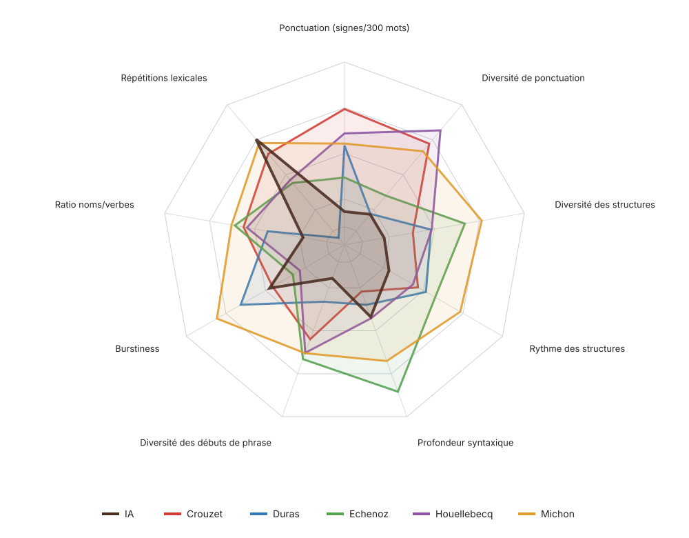
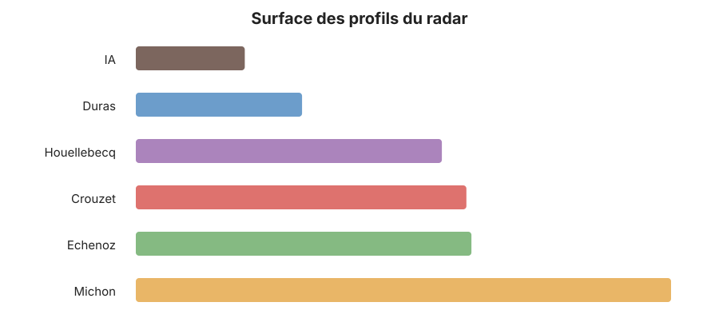
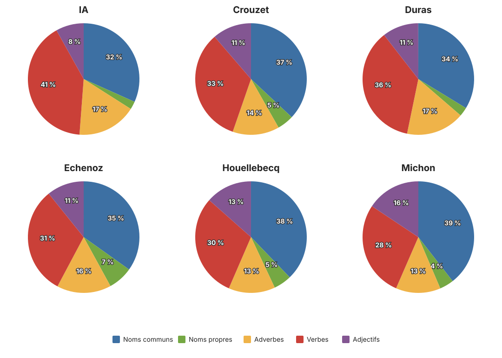

# Unshiter — analyse statistique de textes

Unshiter compare des textes français sans demander à un modèle génératif de les juger. Il mesure leur ponctuation, leur rythme, leurs répétitions, leurs structures syntaxiques et leur répartition grammaticale. Les résultats décrivent les textes du corpus ; ils ne constituent pas une preuve d’origine humaine ou artificielle.

## Installation

```bash
python3 -m venv venv
venv/bin/python -m pip install -r requirements.txt
```

Le projet utilise spaCy 3.8.13 avec le modèle français `fr_core_news_lg` 3.8.0. Le modèle est installé par `requirements.txt`.

## Lancer une comparaison

Placez les fichiers Markdown dans `sources/`, puis lancez :

```bash
./stats.sh
```

Les fichiers sont classés ainsi :

- un fichier sans `_` initial est considéré comme un texte IA ;
- tous les fichiers IA sont fusionnés dans une seule colonne `IA` ;
- un fichier commençant par `_` est considéré comme humain ;
- les textes humains sont affichés après `IA`, par ordre alphabétique ;
- le `_` initial et l’extension `.md` ne sont pas affichés dans les titres.

Pour analyser un seul fichier et produire ses rapports Markdown et JSON :

```bash
./stats.sh sources/IA.md
```

## Fichiers produits

Les sorties sont écrites dans `_output/` :

- `stats_comparison.md` : tableaux comparatifs et graphiques intégrés ;
- `kiviat.svg` : radar des mesures du tableau principal ;
- `kiviat_areas.svg` : surface des profils du radar, classée par ordre croissant ;
- `grammatical_distribution.svg` : camemberts grammaticaux, trois par ligne ;
- `*_structure.md` : phrases et structures reconnues ;
- `*_lemmes.md` : textes lemmatisés avec répétitions signalées.

## Dernier résultat

Ce tableau est un instantané du dernier corpus analysé. Il n’est pas recalculé par GitHub : après une nouvelle analyse, les valeurs et les copies des graphiques dans `assets/readme/` doivent être actualisées.

| Mesure | IA | Crouzet | Duras | Echenoz | Houellebecq | Michon | σ[^1] |
|---|---:|---:|---:|---:|---:|---:|---:|
| Ponctuation (signes/300 mots)[^2] | 36.1 | 57.9 | 50.2 | 43.4 | 52.7 | 50.6 | 14.4 % |
| Diversité de ponctuation[^3] | 40 % | 61 % | 40 % | 45 % | 64 % | 58 % | 19.6 % |
| Diversité des structures[^4] | 42 % | 48 % | 53 % | 61 % | 53 % | 65 % | 14.3 % |
| Rythme des structures[^5] | 41 % | 49 % | 51 % | 53 % | 47 % | 59 % | 11.0 % |
| Profondeur syntaxique[^6] | 3.7 | 3.2 | 3.5 | 5.1 | 3.7 | 4.5 | 16.2 % |
| Diversité des débuts de phrase[^7] | 52 % | 72 % | 59 % | 78 % | 76 % | 76 % | 14.0 % |
| Burstiness[^8] | 0.69 | 0.68 | 0.79 | 0.60 | 0.58 | 0.87 | 14.6 % |
| Ratio noms/verbes[^9] | 1.56 | 2.09 | 1.88 | 2.17 | 2.06 | 2.20 | 5.4 % |
| Répétitions lexicales[^10] | 9 % | 10 % | 16 % | 12 % | 12 % | 9 % | 11.3 % |







[^1]: σ mesure la dispersion dans ce corpus. Les valeurs aberrantes situées à plus de 1,5 fois l’intervalle interquartile sont retirées du calcul, mais restent affichées dans le tableau. L’écart-type restant est divisé par la moyenne.

[^2]: Nombre de signes de ponctuation pour 300 mots.

[^3]: Entropie de la répartition entre dix familles de ponctuation, ramenée entre 0 et 100 %.

[^4]: Distance moyenne entre les profils de propositions. La nature des constructions compte pour 75 %, leurs nombres pour 25 %, avec un poids progressif jusqu’à douze propositions cumulées. Répéter plusieurs fois la même subordonnée apporte moins de diversité que varier réellement les constructions.

[^5]: Distance d’édition moyenne entre deux structures consécutives, divisée par la longueur de la structure la plus longue.

[^6]: Moyenne de la profondeur maximale des arbres de dépendances spaCy. Elle mesure l’emboîtement grammatical reconnu par le parseur.

[^7]: Part moyenne de premiers mots différents dans des fenêtres glissantes de vingt phrases.

[^8]: Écart moyen en caractères entre deux phrases consécutives, divisé par la longueur moyenne des phrases.

[^9]: Nombre de noms reconnus par Morphalou divisé par le nombre de verbes reconnus.

[^10]: Part des mots reprenant, sous une forme éventuellement fléchie, un lemme rencontré parmi les 300 mots précédents. Les mots-outils sont exclus du signalement.

Une empreinte SHA-256 des sources, du code et des configurations éditables est enregistrée dans `_temp/stats-cache.json`. Si rien n’a changé et que toutes les sorties existent, `./stats.sh` les réutilise sans recommencer l’analyse spaCy.

## Fenêtres de comparaison

Les textes n’ont pas tous la même taille. Pour éviter qu’un roman bénéficie simplement d’un plus grand échantillon, les mesures dérivées sont calculées sur des fenêtres non chevauchantes ayant pour cible le nombre de mots du texte le plus court.

Une fenêtre se termine toujours à la fin d’un paragraphe. Elle peut donc dépasser légèrement la cible. Si la dernière fenêtre contient moins de 70 % de la cible, elle est fusionnée avec la précédente. Les mesures des fenêtres sont ensuite moyennées pour chaque document.

Gzip suit une règle différente : ses blocs sont découpés en octets UTF-8 et ont exactement la taille du texte le plus court en octets. Les comptages techniques — mots, phrases et paragraphes — décrivent toujours le document complet.

## Colonne σ

σ mesure la dispersion d’une ligne dans le corpus :

1. les valeurs aberrantes sont repérées par la règle de Tukey à 1,5 fois l’intervalle interquartile ;
2. elles restent affichées dans le tableau, mais sont retirées du calcul de σ ;
3. l’écart-type des valeurs restantes est divisé par leur moyenne ;
4. le résultat est affiché en pourcentage.

Un σ faible signifie que la mesure varie peu entre les textes conservés. Un σ élevé signifie qu’elle les sépare davantage. Ce nombre dépend entièrement du corpus courant : il ne fournit pas une propriété universelle de la mesure.

## Mesures du tableau principal

### Ponctuation — signes pour 300 mots

Le programme compte `.,;:!?…—–-()«»"`, divise ce total par le nombre de mots et multiplie par 300. Cette mesure décrit la densité de ponctuation, indépendamment de la longueur du document.

### Diversité de ponctuation

Les signes sont répartis en dix familles : point, virgule, point-virgule, deux-points, interrogation, exclamation, tiret, parenthèses, guillemets et points de suspension. L’entropie de cette répartition est divisée par l’entropie maximale possible. Le résultat va de 0 à 100 %. Une valeur basse correspond à une ponctuation concentrée sur quelques signes ; une valeur haute à une répartition plus équilibrée.

### Diversité des structures

Cette mesure ne compte plus simplement les phrases différentes, car cette méthode avantage mécaniquement les phrases longues.

Chaque phrase est transformée en une liste de propositions simplifiées : `SUJET`, `VERBE`, `COMPLÉMENT`, `CONJONCTION` et `PROPOSITION_SUBORDONNÉE`. Les déterminants et prépositions ne sont pas retenus comme rôles. Les virgules et les points restent présents dans les propositions ordinaires. Les répétitions internes sont comptées : une phrase peut être décrite comme `SUJET VERBE COMPLÉMENT + 5 PROPOSITIONS_SUBORDONNÉES`.

La distance entre deux phrases combine :

- 75 % de différence entre les proportions de leurs constructions ;
- 25 % de différence entre les nombres de ces constructions.

Cette distance reçoit ensuite un poids d’information égal à `min(1, racine(nombre cumulé de propositions / 12))`. Deux phrases très courtes ne peuvent donc pas produire à elles seules une opposition maximale. Le bénéfice des architectures longues augmente progressivement jusqu’à douze propositions cumulées, mais cinq subordonnées identiques valent moins que cinq constructions différentes. La valeur finale est la moyenne des distances entre toutes les paires de phrases.

### Rythme des structures

Les structures sont comparées dans leur ordre d’apparition. Pour chaque paire consécutive, une distance d’édition compte les ajouts, suppressions et remplacements nécessaires, puis divise ce nombre par la longueur de la structure la plus longue. Le rapport affiche la moyenne de ces distances. Cette mesure décrit les changements successifs ; la diversité des structures décrit les écarts dans l’ensemble du texte.

### Diversité des débuts de phrase

Le premier mot de chaque phrase est relevé. Dans chaque fenêtre glissante de vingt phrases, le programme divise le nombre de premiers mots différents par vingt, puis moyenne les résultats. Pour moins de vingt phrases, il utilise tout le texte disponible.

### Burstiness

Formule : `moyenne des écarts absolus entre longueurs de phrases consécutives / longueur moyenne des phrases`. Les longueurs sont mesurées en caractères, espaces compris. La division par la moyenne permet de comparer des textes dont les phrases n’ont pas la même longueur générale.

### Ratio noms/verbes

Nombre de noms reconnus par Morphalou divisé par le nombre de verbes reconnus. Une valeur de 2 signifie deux noms pour un verbe. La valeur est fixée à 0 si aucun verbe n’est reconnu.

### Répétitions lexicales

Pour chaque mot, le programme cherche le même lemme parmi les 300 mots précédents. Les flexions sont regroupées grâce à spaCy et Morphalou. Les mots-outils sont exclus du signalement. Le pourcentage est le nombre de mots possédant un antécédent divisé par le nombre de mots analysés.

## Autres mesures de répétition

### Diversité stylistique

Elle vaut `100 % − répétitions stylistiques`. Dans les 300 mots précédents, une graphie identique ajoute 1 point de pression, le même lemme 0,25 et la même famille morphologique 0,25. Les mots-outils et noms propres sont exclus. La pression totale est divisée par le nombre de mots et plafonnée à 100 %.

### Répétitions familiales

Même principe que les répétitions lexicales, mais Démonette rapproche aussi les mots de la même famille morphologique, par exemple *écrire*, *écrivain* et *écriture*.

### Répétitions sonores

Deux prononciations sont rapprochées lorsqu’elles partagent une suite continue d’au moins trois phonèmes couvrant au moins 60 % de la prononciation la plus courte. La recherche porte sur les 300 mots précédents.

### Répétitions non filtrées

Même calcul que les répétitions lexicales, mais les mots-outils sont conservés. Cette mesure inclut donc les répétitions grammaticales ordinaires.

### Trigrammes

Un trigramme est une suite de trois mots. La répétition globale est le nombre de trigrammes distincts apparaissant plusieurs fois divisé par le nombre total de trigrammes distincts. La répétition locale applique la même formule à des fenêtres glissantes de 200 mots, espacées de 50 mots, puis moyenne les résultats.

### Formes par lemme

Dans des sous-fenêtres de 50 mots, le programme divise la diversité mobile des formes graphiques par la diversité mobile des lemmes lexicaux. Une valeur élevée indique davantage de flexions ou de graphies pour un stock comparable de racines. Ce rapport n’est pas un comptage brut des formes de chaque lemme.

### Mots employés une seule fois

Nombre de formes graphiques présentes exactement une fois divisé par le nombre de formes graphiques différentes. Il s’agit de la proportion d’hapax parmi les types, pas parmi toutes les occurrences.

## Longueur et prévisibilité

### Diversité de longueurs de phrase

Écart-type du nombre de mots par phrase. La mesure reste dans le tableau détaillé parce qu’une partie de ce signal est déjà intégrée à la diversité des structures par son poids d’information.

### Compression gzip

Taille gzip divisée par la taille UTF-8 originale. Une valeur basse indique un texte plus facilement compressible. Les comparaisons utilisent des blocs d’octets strictement égaux, car gzip est très sensible à la taille de son entrée.

## Grammaire et syntaxe

Les tableaux utilisent deux sources grammaticales différentes :

- Morphalou fournit les catégories hors contexte utilisées pour les ratios du tableau ;
- spaCy `fr_core_news_lg` fournit la lemmatisation contextuelle, les dépendances, les phrases nominales et les camemberts.

### Mots-outils

Part des déterminants, pronoms, prépositions, conjonctions et interjections. Les adverbes sont exclus. `assets/function-words.txt` complète les catégories de Morphalou et peut être modifié manuellement.

### Noms, verbes, adjectifs et adverbes

Dans le tableau, chaque catégorie Morphalou est divisée par le nombre total de mots auxquels Morphalou attribue une catégorie. Ces quatre pourcentages ne totalisent donc pas nécessairement 100 %. Dans les camemberts, spaCy répartit uniquement noms communs, noms propres, verbes, adjectifs et adverbes ; ces cinq parts totalisent 100 %.

### Relatives et subordonnées

spaCy compte les relatives `acl:relcl` et les dépendances `acl`, `advcl`, `ccomp`, `csubj`, `xcomp`. Leur somme est divisée par le nombre de phrases. Le résultat peut dépasser 100 %, puisqu’une phrase peut contenir plusieurs subordonnées.

### Phrases nominales

Part des phrases dans lesquelles spaCy ne reconnaît aucun verbe ou auxiliaire conjugué. Un infinitif ou un participe isolé ne suffit pas à classer la phrase comme verbale.

### Profondeur syntaxique

Cette mesure décrit le degré d’emboîtement grammatical trouvé par spaCy. Dans une phrase simple, les mots dépendent directement du verbe principal et l’arbre reste peu profond. Dans une phrase comportant des groupes enchâssés, des compléments de propositions ou plusieurs niveaux de subordination, certains mots ne rejoignent la racine qu’après plusieurs relations grammaticales. Le programme conserve cette distance maximale pour chaque phrase, puis en calcule la moyenne. La valeur mesure donc l’imbrication des dépendances reconnues par spaCy, pas la qualité littéraire.

## Valeurs techniques

- **Mots, phrases, paragraphes** : comptages sur le document complet. Une ou plusieurs lignes vides séparent deux paragraphes.
- **Longueur moyenne des mots** : nombre moyen de caractères par mot.
- **Longueur moyenne des phrases** : moyenne en caractères, espaces compris, et moyenne en mots.
- **Médiane, P10 et P90** : percentiles des longueurs en caractères.
- **Écart-type des paragraphes** : dispersion du nombre de mots par paragraphe.
- **Fenêtres analysées** : nombre de fenêtres comparables utilisées pour les moyennes.
- **Longueur moyenne des paragraphes** : nombre moyen de mots par paragraphe.

## Graphiques

Le radar reprend exactement les mesures du tableau principal. Pour chaque axe, le rayon médian correspond à la moyenne du corpus. La position vaut `0,5 + 1,25 × (valeur − moyenne) / moyenne`, limitée entre 0,05 et 1. Les répétitions lexicales sont inversées afin que l’extérieur corresponde à moins de répétitions. Toutes les lignes de lecture utilisent le même gris.

L’histogramme des surfaces applique la formule géométrique de l’aire à chaque polygone du radar, puis classe les auteurs de la plus petite à la plus grande surface. Son unité est arbitraire et dépend des axes retenus, de leur ordre et de l’amplification du radar.

## Limites

- Les résultats dépendent du découpage en phrases, des dictionnaires et du modèle spaCy.
- Morphalou analyse les formes hors contexte et peut conserver des ambiguïtés.
- Les ellipses, incises, phrases nominales et constructions littéraires peuvent dégrader l’analyse spaCy.
- Une mesure très dispersée dans le corpus actuel ne le sera pas nécessairement dans un autre corpus.
- Les graphiques résument les mesures choisies ; ils ne calculent pas une probabilité d’origine IA.

## Organisation du projet

- `script/detector/` : calculs, interface et tests ;
- `assets/` : Morphalou, Démonette, mots-outils et notes du rapport ;
- `sources/` : corpus Markdown ;
- `_output/` : rapports générés ;
- `_temp/` : cache et fichiers temporaires.

Tous les chemins sont définis dans `script/detector/config.py`.

`assets/stats-notes.md` est le texte éditorial des notes affichées dans le rapport. Après la présente réécriture, il ne doit plus être modifié automatiquement : toute proposition ultérieure doit être formulée en commentaire afin de laisser le dernier mot à son auteur.

## Tests

```bash
PYTHONPATH=script python3 -m unittest discover -s script/detector/tests -v
```
